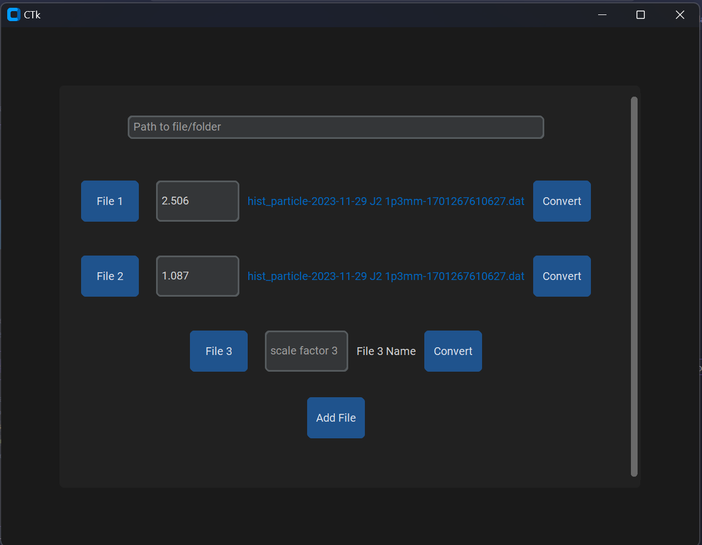

### Hope College Physics Research: 
## Data Format Converter
This repository stores scripts meant to chaange the format data received from the particle accelerator is presented.
So far, there are only 2 scripts, *kmax_ascii_twocol_no_head.py* written by **Dr. Paul DeYoung** who currently sits as 
the chair of the physics department at Hope College and *my_attemps.py* written by **Loïc Rutabana**, a senior here in
the Computer Science department. *my_attemps.py* is meant to be an improvement on *kmax_ascii_twocol_no_head.py*

Using:
 * `Python` Version 3.11.7
 * `TKinter`
 * `CustomTkinter`

Above is a screenshot of *my_attemps.py*. The software is rather easy to use